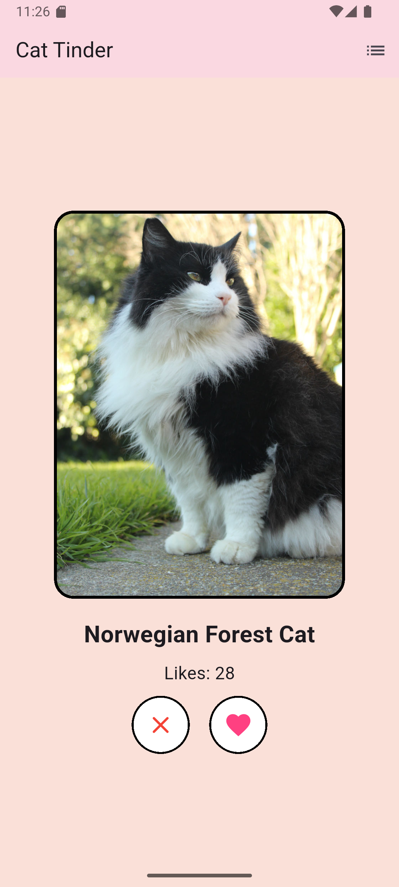
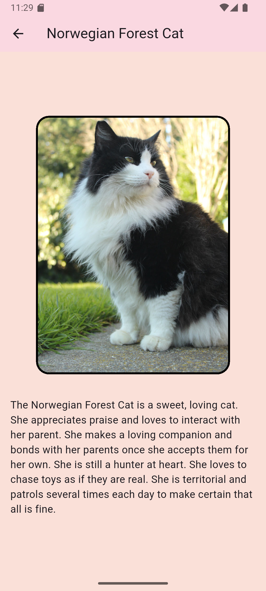
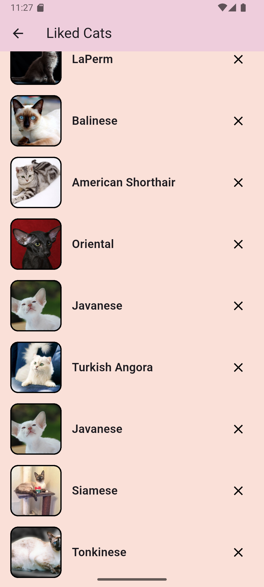
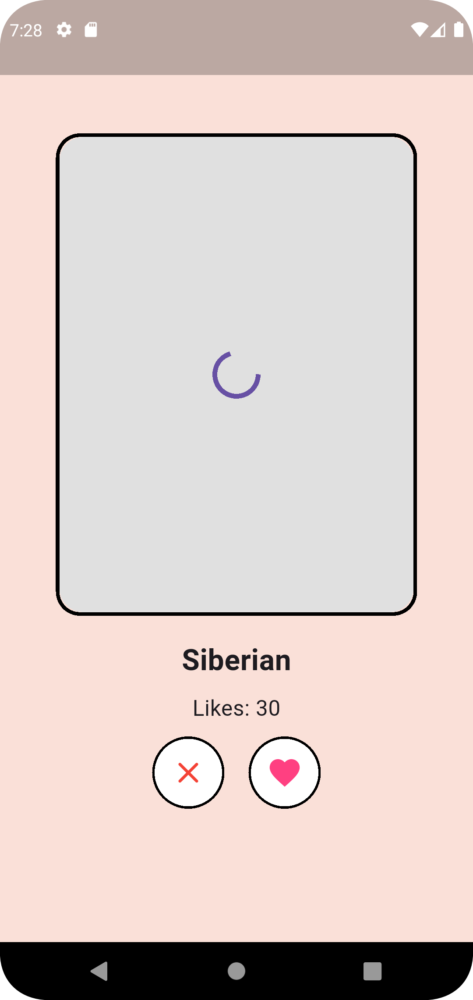

# Cat Tinder

Это приложение позволяет пользователю просматривать
изображения котиков и получать информацию об их породах. 
Пользователь может дизлайкать или лайкать изображения, увеличивая счетчик лайков.
Пользователь может посмотреть список лайкнутых котиков и удалять котика из списка лайкнутых.

## Установка

Скачать и установить APK-файл по ссылке: https://disk.yandex.ru/d/auapJboprUKicQ

## Функционал

### Главный экран
- Кнопка лайка или свайп вправо увеличивает счетчик лайков и запускает поиск нового кота
- Кнопка дизлайка или свайп влево запускает поиск нового кота
- Нажатие на фото котика открывает экран с его описанием
- Нажатие на иконку списка в правом верхнем углу открывает список лайкнутых котиков

### Описание котика
- Фото котика и описание к нему
- Кнопка назад, чтобы вернуться на главный экран

### Список лайкнутых котиков
- Список котиков, состоящий из элементов, на каждом из которых:
  - фото котика
  - порода котика
  - кнопка удаления котика из списка лайкнутых
- Кнопка назад, чтобы вернуться на главный экран

